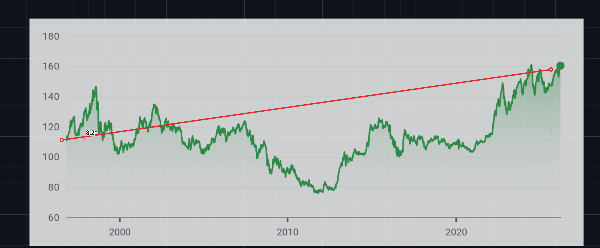

# Angle Tool

Browser-based tool for measuring line angles on charts, screenshots, and images with real-time visual feedback.

## Live Demo
[Open the app](https://qwert11.github.io/slope-angle/)

## Demo

## Features
- Paste image from clipboard
- Drag and drop image onto the page
- Open image from file
- Draw a line and measure angle instantly
- Real-time angle preview while drawing
- Rotation controls: ±90°, ±1°, drag-to-rotate
- Adjustable image opacity for better alignment
- Optional fit mode or original size
- Language switcher (EN / UA) with saved preference
- Clear line without removing the image

## Why I built this
Most existing tools for measuring angles on images are either too heavy or inconvenient for fast analysis.  
This project focuses on a simple workflow:

**paste → align → draw → measure**

## Tech Stack
- Vanilla JavaScript
- HTML5 Canvas
- Clipboard API
- Drag and Drop API
- LocalStorage
- GitHub Pages

## Use Cases
- Measuring trend angles on trading charts
- Checking slope on screenshots
- Fast visual analysis without opening heavy editors

## Running Locally
Just open `index.html` in a browser.

## Deployment
The project is deployed with GitHub Pages.

## Status
Actively improved as a lightweight image angle measurement tool.
